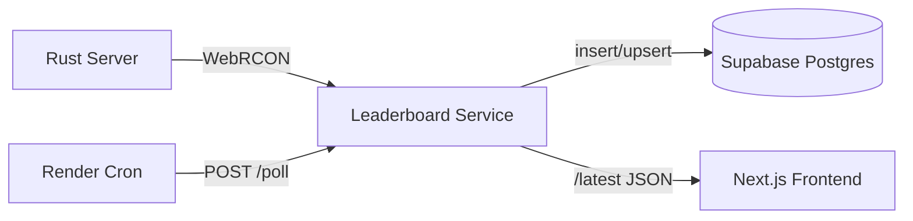

# LLama Rust Leaderboard Service

A small web service + database integration that pulls live data from a Rust game server and makes it available to our website.

---

## What this project actually does

- **Connects to the Rust server via RCON (remote console).**  
  We use the server's RCON password + port to send commands (`serverinfo`, `status`) and get back JSON/text about the server's state.

- **Parses that raw output into structured data.**  
  Example fields:
  - Hostname, map, uptime
  - Player count / max slots / queue
  - Per-player SteamID, name, ping, connected time

- **Writes snapshots into Supabase (Postgres).**  
  Two tables:
  - `rust_server_snapshots`: append-only history of server stats
  - `rust_online_players`: upserted list of who's online right now

- **Exposes a tiny Fastify API.**  
  Routes:
  - `GET /health` → quick check the service is alive  
  - `POST /poll` → runs one poll cycle (RCON → parse → write DB)  
  - `GET /latest` → fetches the most recent snapshot + players for the front-end  

- **Deploys as a Docker container on Render.**  
  Render runs the service, and a cron job hits `/poll` every minute to keep data flowing.

- **Front-end (Next.js) just calls `/latest`.**  
  No need for the website to talk directly to Supabase with elevated keys.

---

## Project layout

```
src/
  server.ts            # Fastify app (endpoints)
  poller.ts            # Orchestrates one poll cycle
  rcon/real.ts         # WebRCON client + parsers
  rcon/index.ts        # Type definitions
  storage/supabase.ts  # Writes snapshots/players to Supabase
  utils/env.ts         # Environment variable loader
```

---

## How it works in English

1. **Every minute**, Render cron sends a POST to `/poll`.  
2. The service opens a **WebSocket RCON connection** to the Rust server.  
3. It runs the commands `serverinfo` and `status`.  
4. We parse the JSON (`serverinfo`) and table (`status`) into JavaScript objects.  
5. We insert a new row in `rust_server_snapshots` and upsert all players in `rust_online_players`.  
6. When the website wants to show the leaderboard, it hits `/latest` and gets back a JSON payload with the freshest snapshot + players.

---

## Local development

1. Clone repo.
2. Environment variables are configured in the Supabase server and will be automatically loaded.
3. Install dependencies:  
   ```bash
   npm install
   ```
4. Run:  
   ```bash
   npm run dev
   ```
5. Test the endpoints:  
   ```bash
   curl http://localhost:8080/health
   curl -X POST http://localhost:8080/poll
   curl http://localhost:8080/latest
   ```

---

## Deployment (Render)

- Build via Dockerfile.  
- Environment variables are configured in the Supabase server.  
- Cron job scheduled to `POST /poll` every minute.  
- Website uses `GET /latest` for display.

---

## Tech Stack (simple terms)

- **Node.js + Fastify**: lightweight web server.  
- **Supabase (Postgres)**: managed database + auth.  
- **WebRCON**: Rust's remote console protocol (over WebSocket).  
- **Docker + Render**: packaging & hosting.  
- **Next.js (frontend)**: displays stats to players.

---

## Why we did it this way

- **WebRCON** is the most reliable way to pull real-time data from a Rust server.  
- **Supabase** gives us Postgres with a nice API + dashboard.  
- **Microservice pattern**: keep data collection isolated from the front-end.  
- **Docker/Render** keeps ops simple (no babysitting VMs).  
- **Cron polling** avoids long-running loops — Render just pings us.

---

## Example output

`GET /latest` returns something like:

```json
{
  "snap": {
    "id": 42,
    "captured_at": "2025-08-23T02:30:00Z",
    "hostname": "[NA] LlamaRust 2x - Solo/Duo/Trios - Thursdays",
    "map": "Procedural Map",
    "players_online": 2,
    "max_players": 100,
    "entity_count": 81334,
    "uptime_seconds": 74077
  },
  "players": [
    {
      "steam_id": "76561199130026764",
      "name": "Spork",
      "ping": 74,
      "connected_seconds": 1385,
      "last_seen": "2025-08-23T02:30:00Z"
    },
    {
      "steam_id": "76561199253695525",
      "name": "W_TexasSand",
      "ping": 21,
      "connected_seconds": 12823,
      "last_seen": "2025-08-23T02:30:00Z"
    }
  ]
}
```

---

## tl;dr

This repo = **Rust server telemetry → Supabase DB → JSON API**.  
Your buddy's Next.js site = just a thin UI over `/latest`.  
We let Render + cron do the heavy lifting.

---

## Data Flow Diagram


